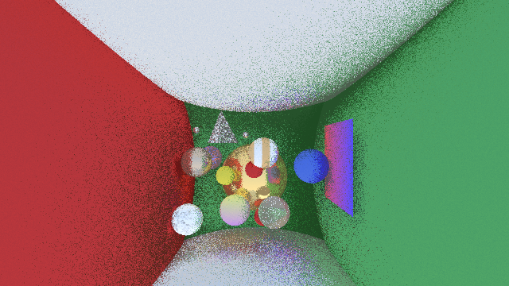
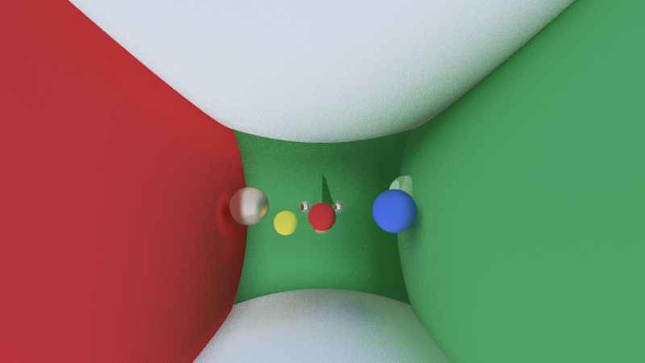

# SIMD Ray Tracer

A high-performance ray tracer built from scratch in C++ with AVX2 SIMD vectorization, OpenMP multi-threading, and GPU acceleration. Features batch rendering, real-time interactive modes, and a retro ASCII terminal renderer.

## Examples

Cornell box (CPU batch, Phong shading, hard shadows, reflections):

| Scanline path | Morton Z-order path | Higher-resolution batch |
|:---:|:---:|:---:|
|  |  |  |
| `raytracer_batch_cpu -w 640 -s 2 -d 4` | same flags + `--morton` | earlier `make batch-cpu` render |

*Interactive (SDL) and GPU modes produce similar scenes with live controls; see **Quick Start** below.*

## Features

### Multiple Rendering Modes

**CPU Interactive Mode**
- Real-time SDL2-based rendering with full controls
- 6 quality levels (320x180 to 1920x1080)
- WASD + mouse camera controls
- Screenshot capture (PNG)
- Settings panel with live adjustments
- Performance stats (FPS, MRays/sec)

**GPU Interactive Mode**
- OpenGL compute shader acceleration
- 60-300x faster than CPU (depending on GPU)
- Same controls as CPU mode
- Real-time GPU/CPU switching

**ASCII Terminal Mode**
- Pure terminal rendering (no GUI required)
- Animated camera orbits scene
- Quality presets (1-3)
- Cross-platform (macOS/Linux/Windows)

**Batch Rendering**
- High-quality offline rendering
- PNG output with configurable settings
- Anti-aliasing (up to 256 samples)
- Command-line interface

### Rendering Features

**Lighting & Shading**
- Phong shading (ambient + diffuse + specular)
- Hard shadows with shadow rays
- Recursive reflections (configurable depth)
- Gamma correction

**Materials**
- Lambertian (diffuse)
- Metal (reflective)
- Dielectric (glass/refraction)

**Advanced Features** (CPU Interactive Mode)
- **Progressive Rendering**: Multi-pass refinement for 3.164x speedup
- **Adaptive Sampling**: Variance-based sampling for 1.702x speedup
- **Wavefront Rendering**: Tiled cache-coherent processing for 1.358x speedup

**Analysis Modes**
- Normal visualization
- Depth buffer visualization
- Albedo (color) visualization
- Composite rendering

## Quick Start

### Prerequisites

**macOS (Homebrew):**
```bash
brew install gcc sdl2 sdl2_ttf
```

**Ubuntu/Debian:**
```bash
sudo apt update
sudo apt install build-essential libsdl2-dev libsdl2-ttf-dev libomp-dev
```

**Windows (MSYS2):**
```bash
pacman -S mingw-w64-x86_64-gcc mingw-w64-x86_64-SDL2 mingw-w64-x86_64-SDL2_ttf
```

### Build & Run

```bash
# CPU Batch Rendering (with feature flags)
make batch-cpu
make run

# GPU Batch Rendering
make batch-gpu
make run-gpu

# CPU Interactive Mode (recommended for beginners)
make interactive-cpu
make runi-cpu

# GPU Interactive Mode (standalone, GLSL 1.20)
make interactive-gpu
make runi-gpu

# GPU Quality Presets
make gpu-fast           # Maximum performance (Phong only)
make gpu-interactive    # Balanced quality and performance
make gpu-production     # High quality for final renders
make gpu-showcase       # Maximum quality all features

# ASCII Terminal Mode (retro style)
make ascii
make runa
```

**Note:** `make interactive` and `make runi` are convenience aliases for CPU mode.

**⚠️ IMPORTANT:** When the interactive ray tracer starts, **press H** immediately to see the help overlay with all controls!

## Controls

### CPU Interactive Mode

**Movement:**
- **WASD** - Move forward/left/backward/right
- **Arrow Keys** - Move up/down
- **Mouse** - Look around (when captured)
- **Left Click** - Capture/release mouse

**Quality Levels:**
- **1** - Preview (320x180, 1 sample)
- **2** - Low (640x360, 1 sample)
- **3** - Medium (800x450, 4 samples)
- **4** - High (1280x720, 16 samples)
- **5** - Ultra (1600x900, 32 samples)
- **6** - Maximum (1920x1080, 64 samples)

**Rendering Features:**
- **M** - Cycle analysis modes (Normal/Normals/Depth/Albedo)
- **Space** - Pause/resume rendering
- **S** - Save screenshot (PNG)
- **C** - Toggle controls panel
- **H** - Toggle help overlay
- **ESC** - Quit

### Settings Panel

The settings panel (press **C**) provides:

**Quality Presets:** Buttons 1-6
**Samples Per Pixel:** 1, 4, 8, 16
**Max Depth:** 1, 3, 5, 8
**Resolution:** Low to Max presets

**Feature Toggles:**
- Shadows (ON/OFF)
- Reflections (ON/OFF)
- Progressive Rendering (ON/OFF)
- Adaptive Sampling (ON/OFF)
- Wavefront Rendering (ON/OFF)

**Debug Modes:**
- Normals visualization
- Depth visualization
- Albedo visualization

**Actions:**
- Screenshot button
- Reset defaults

### GPU Interactive Mode

**Movement:**
- **WASD** - Move forward/left/backward/right
- **Arrow Keys** - Move up/down
- **Mouse** - Look around (when captured)
- **Left Click** - Capture/release mouse

**Rendering Controls:**
- **R** - Toggle reflections
- **P** - Toggle Phong/PBR lighting
- **L** - Cycle light configurations (1 → 2 → 3 lights)
- **G** - Toggle Global Illumination
- **[ / ]** - Adjust GI samples (1-8)
- **- / =** - Adjust GI intensity
- **H** - Help overlay
- **C** - Controls panel
- **S** - Save screenshot (PNG)
- **ESC** - Quit

**Phase 3 Features:**
- ✅ **Global Illumination**: Real-time color bleeding and indirect lighting
- ✅ **Quality Presets**: Fast (2 samples), Balanced (4 samples), Quality (8 samples)
- ✅ **Interactive Adjustment**: Fine-tune GI in real-time

## Performance

### Full Optimization Stack

**Parallelization and SIMD:**
| Configuration | Time | Throughput | Speedup |
|--------------|------|------------|---------|
| Baseline (scalar, 1 thread) | ~67.2s | ~0.09 MRays/s | 1.0x |
| + AVX SIMD | ~13.4s | ~0.45 MRays/s | **5.0x** |
| + OpenMP (4 cores) | ~4.5s | ~1.35 MRays/s | **14.9x** |
| AVX + OpenMP | ~3.4s | ~1.80 MRays/s | **19.8x** |

**Phase 1 Optimizations (on top of AVX+OpenMP):**
| Optimization | Time | Throughput | Speedup | Improvement |
|--------------|------|------------|---------|-------------|
| AVX + OpenMP baseline | 3.4s | 1.80 MRays/s | 1.0x | - |
| + Shadow Culling | 3.1s | 1.95 MRays/s | 1.09x | +8.6% |
| + Fast RNG | 3.0s | 2.00 MRays/s | 1.11x | +2.8% |
| + Loop Unrolling | 2.9s | 2.07 MRays/s | 1.15x | +3.5% |

**Advanced Rendering Modes:**
| Rendering Mode | Time | Throughput | Speedup |
|----------------|------|------------|---------|
| Standard (fully optimized) | 1.540s | 3.740 MRays/s | 1.0x |
| Progressive | 0.487s | 11.836 MRays/s | **3.164x** |
| Adaptive | 0.905s | 6.367 MRays/s | **1.702x** |
| Wavefront | 1.134s | 5.079 MRays/s | **1.358x** |

### Total Performance Improvement
- **Baseline to Final**: ~67.2s → 1.5s = **43.7x total speedup**
- **Breakdown**: AVX (5x) + OpenMP (4x) + Optimizations (1.15x) = **23x combined**
- **With Advanced Modes**: Up to **73x faster** (Progressive on top of full stack)

### What Each Optimization Does

**Parallelization:**
- **AVX SIMD (4-6x)**: 8-wide vector operations using AVX2 instructions
- **OpenMP (14-20x)**: Multi-threading across 4 CPU cores with dynamic scheduling
- **Pthreads (12-18x)**: Manual thread management with custom scheduling (alternative to OpenMP)

**Code Optimizations:**
- **Shadow Culling (+8.6%)**: Skips shadow rays for backfaces (eliminates ~50% of shadow rays)
- **Fast RNG (+2.8%)**: XOR-shift algorithm replaces rand() (eliminates lock contention)
- **Loop Unrolling (+3-5%)**: Reduces loop overhead in sample accumulation

**Rendering Modes:**
- **Progressive (3.164x)**: Multi-pass refinement from noisy to smooth over multiple frames
- **Adaptive (1.702x)**: Variance-based sampling (uses half the samples)
- **Wavefront (1.358x)**: Tiled cache-coherent processing (better CPU cache utilization)

### GPU Performance

**Expected Performance (by GPU tier):**
- **Low-end GPUs**: 30-60 MRays/sec (30-75x faster than CPU)
- **Mid-range GPUs**: 100-200 MRays/sec (100-250x faster)
- **High-end GPUs**: 300-500 MRays/sec (300-600x faster)

**GPU vs CPU Comparison (1920x1080):**
| Samples | CPU Time | GPU Time | Speedup |
|---------|----------|----------|---------|
| 1       | 2.5s     | 0.04s    | 62x     |
| 4       | 10.0s    | 0.08s    | 125x    |
| 16      | 40.0s    | 0.25s    | 160x    |
| 64      | 160.0s   | 0.80s    | 200x    |

**Interactive Performance:**
- **640x360** (1 sample): 120-240 FPS
- **800x450** (4 samples): 30-60 FPS
- **1920x1080** (16 samples): 8-15 FPS

**GPU Features (Phase 1, 2, 3, 3.5 & 4):**
- ✅ **Physically Based Rendering (PBR)**: Cook-Torrance BRDF with realistic materials
- ✅ **Multiple Lights**: 1-4 configurable light sources with 3-point studio setups
- ✅ **Soft Shadows**: Stratified area light sampling for natural penumbra
- ✅ **Ambient Occlusion**: Ray-traced AO for depth perception
- ✅ **Global Illumination**: Real-time color bleeding and indirect lighting (Phase 3)
- ✅ **Screen-Space Reflections**: Real-time ray traced reflections (Phase 3.5)
- ✅ **Environment Mapping**: Procedural sky with realistic sun and ground (Phase 3.5)
- ✅ **Glossy Reflections**: Roughness-based reflection quality (Phase 3.5)
- ✅ **SSAO**: Screen-space ambient occlusion for enhanced depth (Phase 4)
- ✅ **Bloom**: Cinematic glow effect for bright areas (Phase 4)
- ✅ **Vignette**: Cinematic edge darkening (Phase 4)
- ✅ **Film Grain**: Procedural film grain effect (Phase 4)
- ✅ **Advanced Tone Mapping**: Multiple operators (ACES, Reinhard, Filmic, Uncharted 2) (Phase 4)
- ✅ **Color Grading**: Exposure, contrast, and saturation controls (Phase 4)
- ✅ **Quality Presets**: Fast, Interactive, Production, Showcase, GI, SSR, Environment, SSAO, Bloom, Cinematic presets

**Quality Presets:**
```bash
# GPU Rendering Presets
make gpu-fast          # Maximum performance (Phong, single light)
make gpu-interactive   # Balanced (PBR, multiple lights)
make gpu-production    # High quality (+ soft shadows)
make gpu-showcase      # Maximum quality (all features + demo scene)

# Global Illumination Presets (Phase 3)
make gi-fast           # Fast GI (2 samples, low intensity)
make gi-balanced       # Balanced GI (4 samples, medium intensity)
make gi-quality        # Quality GI (8 samples, high intensity)

# Advanced Reflections Presets (Phase 3.5)
make ssr-fast          # Fast screen-space reflections (8 samples)
make ssr-quality       # Quality SSR (24 samples)
make env-quality       # Environment mapping with sky
make phase35-complete  # All features: GI + SSR + Environment

# Post-Processing Presets (Phase 4)
make ssao-quality      # Phase 3.5 + SSAO (depth enhancement)
make bloom-quality     # Phase 3.5 + Bloom (cinematic glow)
make cinematic-quality # Phase 3.5 + Vignette + Film Grain
make phase4-complete   # ALL features: Phase 3.5 + SSAO + Bloom + Vignette + Film Grain
```

**GPU Advantages:**
- Raw throughput: 60-300x faster than CPU
- Real-time 1080p rendering
- State-of-the-art PBR lighting
- Better for high sample counts
- Smooth interactive experience

**GPU Limitations:**
- No progressive/adaptive/wavefront optimizations (by design - GPU optimized for throughput)
- Simplified scene representation (for GPU parallelism)
- No analysis modes (CPU-only feature)
- Requires OpenGL 2.0+ support

### Benchmarks
```bash
# Quick benchmark (current phase)
make bench

# Comprehensive benchmark (all phases)
make benchmark-all

# Compare results
make compare
```

## Project Structure

```
ray-tracer/
├── README.md              # This file
├── readme-examples/       # Showcase images linked from the README (tracked PNGs)
├── Makefile               # Build system
├── LLM_CONTEXT.md         # Project context for AI assistants (claude.md → symlink)
├── INTERACTIVE_GUIDE.md   # Interactive mode guide
├── CHANGELOG.md           # Development history
├── docs/                  # Comprehensive documentation
│   ├── index.md           # Main documentation index
│   ├── cpu-performance-results.md    # Performance benchmarks
│   ├── ASCII_RENDERER.md  # ASCII mode documentation
│   └── ...
├── src/
│   ├── main.cpp           # Batch ray tracer
│   ├── main_cpu_interactive.cpp  # CPU interactive mode
│   ├── main_gpu_interactive.cpp  # GPU interactive mode
│   ├── main_ascii.cpp     # ASCII terminal mode
│   ├── math/              # Vec3, Ray, SIMD operations
│   ├── primitives/        # Sphere, Triangle, Primitive base
│   ├── material/          # Lambertian, Metal, Dielectric
│   ├── camera/            # Camera with perspective projection
│   ├── scene/             # Scene graph, Lights, Cornell Box
│   ├── renderer/          # Ray tracing logic, GPU renderer
│   └── texture/           # Texture system
├── external/              # External libraries (stb_image_write)
└── build/                 # Build artifacts
```

## Makefile Targets

### Building
```bash
make batch-cpu         # Build CPU batch ray tracer
make batch-gpu         # Build GPU batch ray tracer
make interactive-cpu   # Build CPU interactive (SDL2)
make interactive       # Alias for interactive-cpu
make interactive-gpu   # Build GPU interactive (GLSL 1.20)
make ascii             # Build ASCII terminal
make all               # Build default (batch-cpu)
```

### Running
```bash
make run               # Build and run CPU batch
make run-gpu           # Build and run GPU batch
make runi-cpu          # Build and run CPU interactive
make runi              # Alias for runi-cpu
make runi-gpu          # Build and run GPU interactive
make runa              # Build and run ASCII terminal
```

### Performance Comparison
```bash
make bench-cpu-modes   # Headless Cornell-box: scalar vs SIMD vs wavefront (see docs/benchmarking.md)
./benchmark_simd_wavefront.sh  # Build bench + run + log under benchmark_results/runs/
make benchmark         # Benchmark CPU feature combinations (writes benchmark_results/runs/)
make benchmark-cpu-gpu  # Compare CPU vs GPU performance (writes benchmark_results/runs/)
```

See **[docs/benchmarking.md](docs/benchmarking.md)** for where to store logs and how to write **`benchmark_results/summaries/`** tables.

### Utilities
```bash
make clean             # Remove build artifacts
make rebuild           # Clean and rebuild
make config            # Show build configuration
make deps              # Check dependencies
make docs              # Show documentation
make help              # Show all targets
```

### Feature Flags
```bash
# Rendering features
make batch-cpu ENABLE_SHADOWS=0          # Disable shadows
make batch-cpu ENABLE_REFLECTIONS=0      # Disable reflections

# CPU optimizations (Phase 1)
make batch-cpu ENABLE_SHADOW_CULLING=1  # Shadow ray culling (+8.6%)
make batch-cpu ENABLE_FAST_RNG=1        # XOR-shift RNG (+2.8%)
make batch-cpu ENABLE_LOOP_UNROLL=1     # Loop unrolling (+3-5%)

# Parallelization and SIMD
make batch-cpu ENABLE_OPENMP=1          # OpenMP multi-threading (+14-20x)
make batch-cpu ENABLE_PTHREADS=1        # Pthreads multi-threading (+12-18x)
make batch-cpu ENABLE_AVX=1             # SIMD vectorization (+4-6x)
make batch-cpu ENABLE_OPENMP=0 ENABLE_PTHREADS=0 ENABLE_AVX=0  # Scalar single-threaded baseline

# Advanced rendering modes
make batch-cpu ENABLE_PROGRESSIVE=1      # Progressive rendering (3.164x)
make batch-cpu ENABLE_ADAPTIVE=1         # Adaptive sampling (1.702x)
make batch-cpu ENABLE_WAVEFRONT=1        # Wavefront rendering (1.358x)

# Performance comparisons
make batch-cpu ENABLE_OPENMP=0 ENABLE_AVX=0  # Compare to scalar baseline
make benchmark  # Full optimization stack comparison
```

## Documentation

Comprehensive documentation is available in the [docs/](docs/) folder:

### GPU Rendering
- **[Phase 4: Post-Processing](docs/GPU_PHASE4_POST_PROCESSING.md)** - SSAO, Bloom, Vignette, Film Grain, Tone Mapping
- **[Phase 3.5: Advanced Reflections](docs/GPU_PHASE35_ADVANCED_REFLECTIONS.md)** - SSR and environment mapping
- **[Phase 3: Global Illumination](docs/GPU_PHASE3_GI.md)** - GI implementation and usage
- **[GPU Comparison Guide](docs/GPU_COMPARISON_GUIDE.md)** - Visual quality comparisons across all phases
- **[GPU Quick Reference](docs/GPU_QUICK_REFERENCE.md)** - Keyboard shortcuts and quality presets
- **[GPU Getting Started](docs/GPU_GETTING_STARTED.md)** - First-time setup and workflow
- **[GPU Renderer Guide](docs/GPU_RENDERER_GUIDE.md)** - Complete GPU implementation guide
- **[GPU Renderer](docs/GPU_RENDERER.md)** - GPU implementation and performance
- **[GPU Improvement Roadmap](docs/GPU_IMPROVEMENT_ROADMAP.md)** - Future GPU improvements and features 🚀

### CPU Rendering
- **[Benchmarking guide](docs/benchmarking.md)** - How to run benchmarks and use **`benchmark_results/`**
- **[CPU Performance Results](docs/cpu-performance-results.md)** - Detailed benchmarks
- **[Performance Optimization Plan](docs/cpu-performance-optimization-plan.md)** - Optimization strategies

### Other Renderers
- **[ASCII Renderer](docs/ASCII_RENDERER.md)** - ASCII mode documentation
- **[Glass Materials Guide](docs/glass-materials-guide.md)** - Dielectric materials

### General Documentation
- **[Overview](docs/index.md)** - Project overview and roadmap

## Screenshot Comparison Workflow

The project includes tools for capturing and comparing visual quality across all rendering phases:

### Automated Screenshot Capture

```bash
# Run the comprehensive screenshot capture script
./capture_comparisons.sh
```

This script will:
- Build each quality preset automatically
- Launch the ray tracer for each phase
- Prompt you to capture screenshots
- Organize screenshots by phase and quality level
- Save all comparisons to `screenshots/comparisons/`

### Manual Screenshot Capture

**For Each Quality Preset:**
1. Build the target: `make [preset]` (e.g., `make gi-balanced`)
2. Run: `./build/raytracer_interactive_gpu`
3. Navigate to a good camera position (WASD + mouse)
4. Enable desired features (G for GI, Shift+S for SSR, E for Environment)
5. Adjust quality settings ([ / ] for GI samples, - / = for intensity)
6. Press **S** to save screenshot
7. Find screenshot in `screenshots/` folder

**Recommended Comparison Shots:**
- **Baseline vs Phase 3.5**: Shows 4-5x quality improvement
- **GI On/Off**: Demonstrates color bleeding effects
- **SSR On/Off**: Shows reflection improvements on metals
- **Environment On/Off**: Displays sky and ground benefits

### Creating Comparison Montages

```bash
# Create side-by-side phase comparison
montage -tile 5x2 -geometry 800x450+2+2 \
    screenshots/comparisons/*.png \
    screenshots/phase_progression.png

# Create before/after comparison
convert \
    screenshots/comparisons/01_baseline_pbr.png \
    screenshots/comparisons/10_phase35_complete.png \
    +append \
    screenshots/before_after.png
```

### Visual Quality Progression

**Phase 1 (Baseline PBR):** ⭐⭐ Basic rendering
**Phase 1.5 (Tone Mapping):** ⭐⭐⭐ Cinematic color
**Phase 2 (Soft Shadows):** ⭐⭐⭐⭐ Enhanced realism
**Phase 3 (GI):** ⭐⭐⭐⭐⭐ Color bleeding & indirect light
**Phase 3.5 (SSR + Environment):** ⭐⭐⭐⭐⭐ Cinematic quality

**Total Achievement:** 4-5x more realistic than baseline, while maintaining real-time performance on Intel integrated GPUs.

## Technical Details

### Compiler Flags
```bash
-O3                    # Maximum optimization
-march=native          # CPU-specific instructions
-mavx2                 # AVX2 SIMD
-mfma                  # Fused multiply-add
-ffast-math            # Aggressive FP optimizations
-fopenmp               # OpenMP multi-threading
-flto                  # Link-time optimization
```

### Architecture

**SIMD Strategy:**
- Primary rays processed in packets of 8 (AVX2 width)
- Shadow rays scalar (incoherent directions)
- Structure of Arrays (SoA) for ray packets

**Rendering Pipeline:**
1. Generate primary rays from camera
2. Find closest intersection
3. Calculate Phong shading
4. Cast shadow rays (with culling)
5. Cast reflection rays
6. Recurse until max depth

**Multi-threading:**
- OpenMP with dynamic scheduling
- Thread-safe framebuffer writes
- Each thread processes disjoint pixels

## Troubleshooting

### Common Issues

**Black Screen:**
- Check enable_shadows and enable_reflections
- Verify scene setup
- Check camera position

**Crashes:**
- Reduce sample count
- Lower resolution
- Check memory usage

**Low Performance:**
- Check thread count: `omp_get_max_threads()`
- Verify AVX2 support
- Lower quality level
- Try GPU mode

### Platform-Specific

**macOS:**
- OpenMP via: `/usr/local/opt/libomp`
- System fonts: `/System/Library/Fonts/`

**Linux:**
- Package manager dependencies vary
- System fonts: `/usr/share/fonts/truetype/`

**Windows:**
- MinGW-w64 or MSVC supported
- vcpkg recommended for dependencies
- Font paths differ significantly

## Contributing

This is an educational project. Feel free to:
- Study the code and documentation
- Implement additional features
- Optimize performance
- Report bugs or issues

## References

- [Ray Tracing in One Weekend](https://raytracing.github.io/books/RayTracingInOneWeekend.html)
- [Intel Intrinsics Guide](https://www.intel.com/content/www/us/en/docs/intrinsics-guide/)
- [PBRT](https://www.pbrt.org/)

## License

MIT License - Feel free to use for learning and experimentation.

---

**Current Status:** CPU optimizations complete with progressive, adaptive, and wavefront rendering. GPU rendering in active development.
